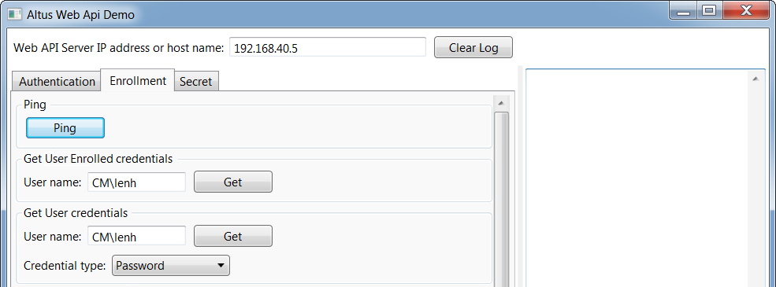
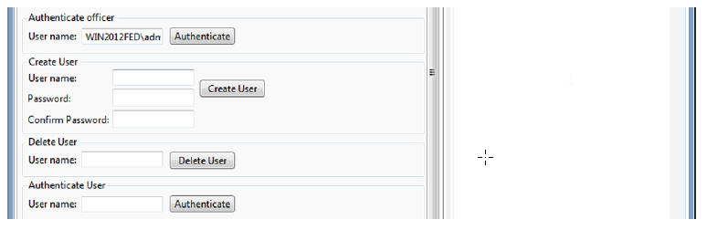
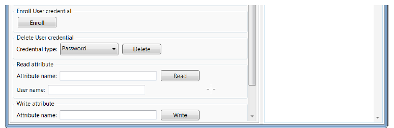
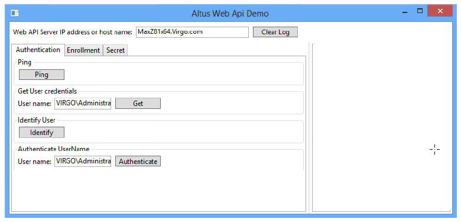
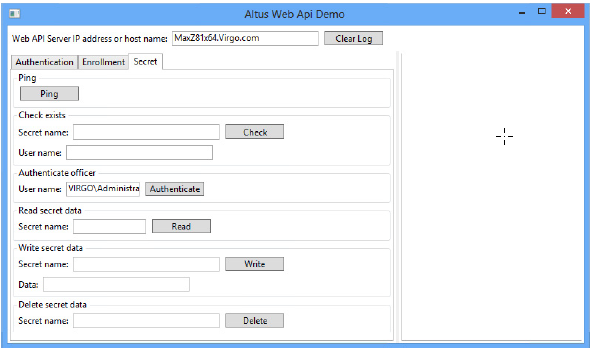



# Overview 1

The sample program (DPWebDemo.exe) creates a GUI displaying fields and buttons that showcase the primary features of the DigitalPersona Web Enrollment Services API.  

We will begin by describing the second tab in the UI, *Enrollment*, since generally speaking you will need to first enroll credentials before you can use them for authentication or identification functions on the first tab.  

Although the sample program will function when the associated DigitalPersona Web Enrollment components are installed on either a DigitalPersona LDS Server or DigitalPersona AD Server, the Create User and Delete User elements only work for a DigitalPersona LDS Server.  

Note: By default, most of the user name fields in the sample application are prepopulated with the current (logged on) Windows User name.
# Enrollment tab

## IP Address or host name
**Purpose**: Specifies the IP Address or host name where the DigitalPersona Web Enrollment components have been installed and where the service is currently running.  
**Actions**: Enter the IP Address or host name for the DigitalPersona Web Enrollment service.   
**Results**: There are no obvious UI changes in the sample application. However, the application will not function until the IP Address or host name has been entered.  

## Ping
**Purpose**: Pings the specified IP Address or host name specified at the top of the sample application window.  
**Actions**: Click *Ping*.  
**Results**: If successful, displays True.  

## Get Enrolled User credentials  

**Purpose**: Gets a list of DigitalPersona credentials that have been enrolled by the user.  
**Actions**: Enter the domain\User name. For example, MyDomain/JohnDoe. Then click *Get*.  
**Results**: If successful, lists the credentials that the specified user has enrolled.  

## Get User credential data  

**Purpose**: Displays the value of certain credentials. For example, show the list of specified questions for the LiveQuestions credential and a list of enrolled fingers for the FingerPrint credential.  
**Actions**: Select credential and click *Get*.  
**Results**: If successful, displays the value of the selected credential.  

## Create User  

**Purpose**: Creates a DigitalPersona (non-domain) user and password.  
**Actions**: Enter a user name and password for the new DigitalPersona LDS user. Then confirm the password and click *Create User*.  
**Results**: If successful, displays *OK*.  
**Notes**: This function in the sample program does not work when the connected web services is running on a DigitalPersona AD server, since it cannot create domain users.  

## Delete User  
**Purpose**: Deletes a DigitalPersona (non-domain) user.  
**Actions**: Enter the user name of a previously created DigitalPersona LDS user. Then click *Delete User*.  
**Results**: If successful, displays *OK*.  
**Notes**: This function in the sample program does not work when the connected web services is running on a DigitalPersona AD server, since it cannot delete domain users.  

## Authenticate User  

**Purpose**: Authenticates a DigitalPersona AD (Windows account) or DigitalPersona LDS user.  
**Actions**: Enter the User name to be authenticated and click Authenticate. In the Credentials window, perform authentication with any credential previously enrolled for the user.  
**Results**: If successful, displays User token accepted. If unsuccessful, displays *The user name or password is incorrect*.  

## Enroll User credential  

**Purpose**: Provides a demonstration of enrolling the various types of  DigitalPersona credentials.  
**Actions**: Click *Enroll* and follow the onscreen instructions for enrolling each specific credential. For additional detailed instructions on enrolling credentials, see your DigitalPersona Client Guide.  
**Results**: If successful, displays *OK*.  

## Delete User credential  

**Purpose**: Deletes the selected credential.  
**Actions**: Select a credential from the Password dropdown menu. Then click *Delete*.  
**Results**: If successful, displays *OK*.

## Read attribute  

**Purpose**: Reads the value of a defined attribute for a specified user.  
**Actions**: Enter an attribute name and User name. Then click *Read*.  
**Results**: If successful, displays the value of the attribute.  

## Write attribute  

**Purpose**: Writes a value to a defined attribute for a specified user.  
**Actions**: Enter an Attribute name, an Attribute value and a valid User name. Then click *Write*.  
**Results**: If successful, displays *OK*.  

# Authentication tab  

## Ping  

**Purpose**: Pings the specified IP Address or host name specified at the top of the sample application window.  
**Actions**: Click *Ping*.  
**Results**: If successful, displays *OK*.  

## Get Enrolled User credentials  

**Purpose**: Gets a list of DigitalPersona credentials that have been enrolled by the user.  
**Actions**: Enter the domain\User name. For example, MyDomain/JohnDoe. Then click *Get*.  
**Results**: If successful, lists the credentials that the specified user has enrolled.  

## Identify User  

**Purpose**: Identifies the specified user.  
**Actions**: Click *Identify*.  
**Results**: Displays a Credentials Window where you can submit a DigitalPersona credential to verify the identity of the specified user. If successful, displays the name of the identified user.  

## Authenticate UserName  

**Purpose**: Authenticates the specfied UserName  
**Actions**: Click *Authenticate*.  
**Results**: If successful, displays *Ticket accepted*.

# Secret tab  

## Ping  

**Purpose**: Pings the specified IP Address or host name specified at the top of the sample application window.  
**Actions**: Click *Ping*.  
**Results**: If successful, displays *True*.  

## Check exists  

**Purpose**: Checks whether or not the named secret exists for the specified user.  
**Actions**: Enter Secret name and User name. Then click Check.  
**Results**: If successful, displays True. Otherwise displays False.  

## Authenticate officer  

**Purpose**: Authenticates a member of the Security Officers group through their User name and password.  
**Actions**: Click *Authenticate*. Then enter the Security Officer’s password.  
**Results**: If successful, displays *Officer token accepted*.  

### Read secret data  

**Purpose**: Reads the data stored in a specified secret for the designated user.  
**Actions**: Enter the secret name. Then click Read.  
**Results**: If successful, displays the value of the secret.  

### Write secret data  

**Purpose**: Writes specified secret data to the named secret for a specified user.  
**Actions**: Enter the secret name and data. Then click *Write*.  
**Results**: If successful, displays *OK*.  

### Delete secret data  

**Purpose**: Deletes specified secret data to the named secret for a specified user.  
**Actions**: Enter the secret name. Then click *Delete*.  
**Results**: If successful, displays *True*.
